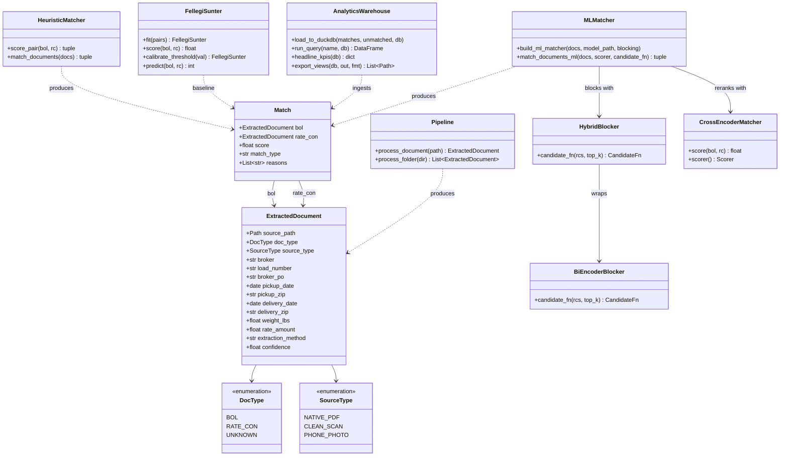
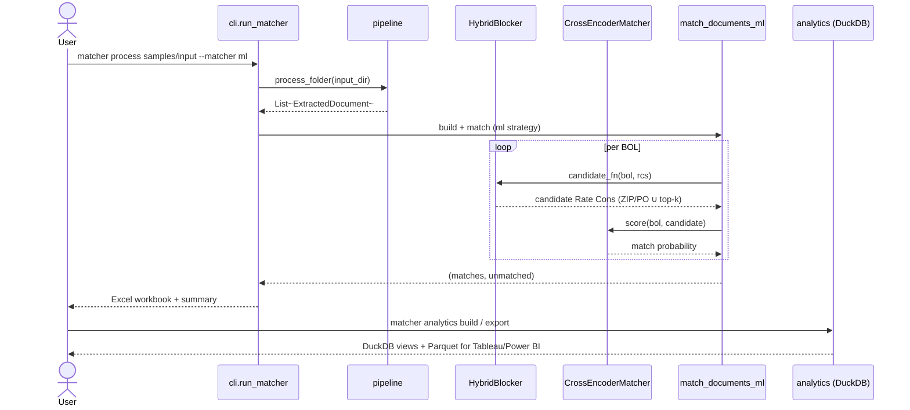

# Freight Doc Matcher

A Python CLI that ingests a folder of **Bill of Lading (BOL)** and **Rate Confirmation** PDFs from freight brokers, extracts key fields, matches BOLs to their corresponding Rate Cons, renames and organizes the files by broker, and produces a **clickable Excel spreadsheet** — all in under two minutes.

**Target user:** Freight dispatchers / trucking company back-office staff who receive 20–50 mixed PDFs per day and currently match them by hand.

---

## The Problem

A dispatcher's inbox fills up every morning with rate confirmations from TQL, C.H. Robinson, Coyote, and a dozen other brokers — each with a different format. The matching BOLs come in from drivers throughout the day. Someone has to open each PDF, find the load number or PO#, and manually sort them into folders so accounting can invoice correctly. This tool automates that.

---

## Quickstart

```bash
# 1. Install (requires Python 3.11+)
pip install -e .

# 2. Copy env and add your Anthropic key (optional — for scanned/photo docs)
cp .env.example .env

# 3. Generate synthetic demo docs
python scripts/generate_synthetic_docs.py

# 4. Run the matcher
matcher process samples/input

# 5. Open output/loads.xlsx
```

System dependencies for OCR (scanned PDFs):
- **Windows:** [install Tesseract](https://github.com/UB-Mannheim/tesseract/wiki) + `pip install pymupdf`
- **macOS:** `brew install tesseract`
- **Ubuntu:** `apt install tesseract-ocr`

---

## Architecture

```
input PDFs
    │
    ▼
classify_pdf()          ← native text? scan? phone photo?
    │
    ▼
extract_text()          ← pdfplumber (native) or PyMuPDF+Tesseract (scan)
    │
    ▼
detect_broker()         ← registry lookup on first 2 000 chars
    │
    ▼
extract_fields_regex()  ← general + broker-specific regex patterns
    │
    ▼ (if < 3 critical fields)
extract_with_claude()   ← Haiku text or vision fallback
    │
    ▼
match_documents()       ← additive scoring, 100-pt scale
    │
    ▼
organize_files()        ← copy + rename into output/{BROKER}/
    │
    ▼
write_spreadsheet()     ← openpyxl with hyperlinks
```

---

## How Matching Works

Each BOL is scored against every Rate Con on a **0–100 point scale**:

| Signal | Points |
|---|---|
| Exact load number (normalized) | **100 — immediate match** |
| Exact broker PO# | +40 |
| Pickup ZIP match | +20 |
| Delivery ZIP match | +20 |
| Pickup date ±1 day | +15 |
| Delivery date ±1 day | +15 |
| Weight within 5% | +10 |
| Pickup city fuzzy >85 | +5 |
| Delivery city fuzzy >85 | +5 |
| Same broker | +5 |

**Thresholds:** ≥70 → auto-match · 50–69 → manual review · <50 → no match

This rulebook is fast and works well on clean data, but its weights are hand-picked
and it leans heavily on the load number. See the next section for a learned
alternative that is far more robust on noisy, ambiguous data.

---

## Fine-Tuned Matching (deep entity matching)

The heuristic above is available as a benchmark baseline; the recommended matcher is a
**fine-tuned transformer** pipeline (Ditto, VLDB 2020) that *learns* how to pair
documents instead of using hand-tuned weights:

```
docs → bi-encoder blocking (top-k candidates) → fine-tuned cross-encoder (decision)
```

- **Bi-encoder** (`all-MiniLM-L6-v2`) embeds each document and retrieves each BOL's
  top-k candidate Rate Cons — turning O(N²) comparisons into ~O(k·N).
- **Cross-encoder** (`distilbert-base-uncased`) reads a BOL and candidate Rate Con
  *jointly* and outputs a match probability. It's fine-tuned on labeled pairs.

On a realistic **recurring-lane** benchmark (a carrier running the same lanes
repeatedly, with OCR noise) the hand-tuned heuristic collapses to **F1 ≈ 0.65** while
a learned model recovers to **≈ 0.99**. Full methodology and numbers:
[docs/efficiency_writeup.md](docs/efficiency_writeup.md).

```bash
# Requires the [ml] extra on Python 3.11–3.13 (PyTorch has no 3.14 wheels yet).
pip install -e ".[ml]"
# RTX 5050 / Blackwell GPUs need a CUDA build:
#   pip install torch --index-url https://download.pytorch.org/whl/cu124

python scripts/build_training_set.py --count 500      # labeled pairs -> data/
python scripts/train_matcher.py --epochs 3            # fine-tune on GPU -> models/
python scripts/benchmark_matching.py --lanes 8 --noise 0.7   # compare strategies

matcher process samples/input --matcher ml            # use the fine-tuned model
```

If torch or a trained model is missing, `--matcher ml` automatically falls back to the
heuristic with a warning, so the core CLI always works.

---

## Analytics & BI Layer

The matched output is loaded into a **DuckDB** table and exposed as analytical SQL
views (lane profitability, broker scorecard, match quality, exception queue), then
exported to **Parquet/CSV** for Tableau / Power BI. Dashboard spec:
[docs/tableau_powerbi_spec.md](docs/tableau_powerbi_spec.md) · data model:
[docs/data_model.md](docs/data_model.md).

```bash
pip install -e ".[bi]"
matcher analytics build samples/input            # process + load into DuckDB
matcher analytics query lane_summary             # print a view
matcher analytics export --format parquet        # -> output/exports/*.parquet
```

Every row derives from a real matched load or unmatched document — no fabricated data.

---

## Fine-Tuned Matching & Analytics

This project is a portfolio-grade data-science build that stays true to its identity
(a freight **document matcher**). Three layers sit on top of the extraction +
heuristic-matching core, none of which change the existing `process` behavior by
default:

**1. Deep entity matching (`src/matcher/linkage/`).** The hand-tuned 100-point scorer
is now one of three strategies. The recommended `--matcher ml` path implements the
**retrieve-then-rerank** architecture from *Ditto* (Li et al., VLDB 2020):
- **Serialize** each document to a tagged `[COL] field [VAL] value` string.
- **Block** with a hybrid candidate generator — structural keys (shared ZIP / PO) ∪
  a bi-encoder (`all-MiniLM-L6-v2`) semantic top-k — to avoid O(n²) comparisons.
- **Decide** with a **fine-tuned cross-encoder** (`distilbert-base-uncased`) that reads
  a BOL and candidate Rate Con jointly and outputs a match probability.

A classic **Fellegi–Sunter** probabilistic linkage model and the original heuristic are
retained as benchmark baselines. On a labeled synthetic benchmark the fine-tuned model
scores **F1 1.000 on held-out pairs**; full methodology, results, and the blocking
diagnosis are in [docs/efficiency_writeup.md](docs/efficiency_writeup.md).

**2. SQL analytics layer (`src/matcher/analytics/`).** Matched output is loaded into a
**DuckDB** `loads` table exposing analytical SQL views (lane profitability, broker
scorecard, match quality, exception queue) and exported to **Parquet/CSV** for Tableau /
Power BI ([docs/tableau_powerbi_spec.md](docs/tableau_powerbi_spec.md),
[docs/data_model.md](docs/data_model.md)).

**3. Reproducible data & training tooling (`scripts/`).** A seeded synthetic generator
(`build_training_set.py`) with OCR-style noise, hard negatives, and a recurring-lane
hard mode; GPU fine-tuning (`train_matcher.py`); and a three-way benchmark
(`benchmark_matching.py`). New optional install extras keep the core lean:
`pip install -e ".[ml]"` (PyTorch stack, Python 3.11–3.13) and `".[bi]"` (DuckDB/pandas).

### System Design (UML)

**Domain model + components**



**End-to-end flow (`matcher process --matcher ml` → analytics)**



---

## Supported Brokers

TQL · C.H. Robinson · Coyote · Landstar · Echo Global · RXO · King of Freight · Andover · Uber Freight · Transplace · Mode · Nolan · Worldwide Express

---

## CLI Reference

```bash
matcher process <input_dir> [--output <dir>] [--no-claude] [--dry-run] [--matcher heuristic|ml]
matcher classify <file>   # Debug: show source type
matcher extract <file>    # Debug: show extracted fields as JSON
matcher version

# Analytics (requires the [bi] extra)
matcher analytics build <input_dir> [--db <path>] [--matcher heuristic|ml]
matcher analytics query <name>          # lane_summary | broker_scorecard | match_quality | exception_queue
matcher analytics export [--format parquet|csv] [--out <dir>]
```

---

## Environment Variables

| Variable | Default | Description |
|---|---|---|
| `ANTHROPIC_API_KEY` | — | Required for Claude fallback |
| `CLAUDE_MODEL` | `claude-haiku-4-5-20251001` | Model for extraction |
| `TESSERACT_CMD` | system PATH | Override Tesseract binary path |
| `MATCHER_LOG_LEVEL` | `INFO` | Logging verbosity |

---

## Running Tests

```bash
pytest                        # all tests
pytest --cov=matcher          # with coverage
```

---

## Limitations & Future Work

- **Web UI** — Next.js + FastAPI wrapper; CLI-first architecture makes this a thin layer.
- **Google Drive / Sheets** integration — poll a shared inbox automatically.
- **Auto-learning broker templates** — few-shot fine-tuning from confirmed matches.
- **Handwritten annotation OCR** — driver notes written on BOLs.
- **Multi-leg loads** — split shipments with multiple pickup/delivery stops.
- **TMS integration** — McLeod, Tai, Trimble direct API push.
- **Email ingestion** — parse attachments from broker email threads directly.
