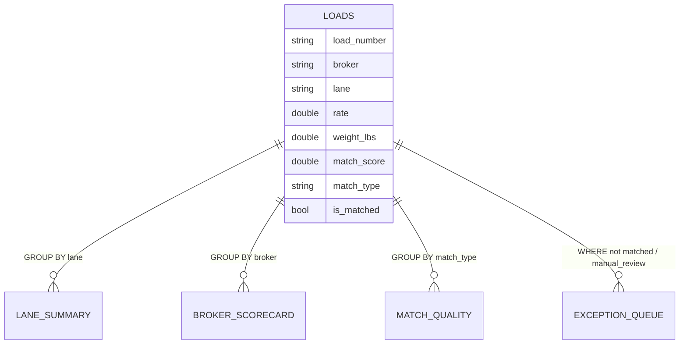

# Analytics Data Model

The analytics layer loads the matcher's real output into a single DuckDB table,
`loads`, and exposes analytical views on top of it. Every row derives from a real
`Match` (a paired BOL + Rate Con) or an unmatched `ExtractedDocument` — no
synthetic/fabricated business data.

## `loads` table (one row per matched load or unmatched document)

| column             | type    | notes                                              |
|--------------------|---------|----------------------------------------------------|
| load_number        | VARCHAR | coalesced BOL/Rate-Con load #                      |
| broker             | VARCHAR | detected broker code                               |
| lane               | VARCHAR | `"Origin, ST -> Dest, ST"`                         |
| pickup_city/state/zip   | VARCHAR | coalesced (BOL value wins)                     |
| pickup_date        | DATE    |                                                    |
| delivery_city/state/zip | VARCHAR |                                                |
| delivery_date      | DATE    |                                                    |
| weight_lbs         | DOUBLE  |                                                    |
| rate               | DOUBLE  | from the Rate Con (fallback: BOL)                  |
| match_score        | DOUBLE  | matcher confidence (0–100)                         |
| match_type         | VARCHAR | `exact_load` \| `fuzzy` \| `manual_review` \| `unmatched` |
| is_matched         | BOOLEAN | false for orphan documents                         |
| doc_type           | VARCHAR | `MATCH` for pairs; `BOL`/`RATE_CON` for unmatched  |
| extraction_method  | VARCHAR | `native` \| `tesseract` \| `claude`                |
| confidence         | DOUBLE  | extraction confidence (0–1)                        |
| bol_path, rc_path  | VARCHAR | source file paths                                  |

## Views (defined in `src/matcher/analytics/queries.py`)

- **lane_summary** — revenue, volume, avg rate/weight, and rate-per-1k-lbs per lane.
- **broker_scorecard** — documents, matched count, match-rate %, avg match score,
  revenue per broker (uses conditional aggregation).
- **match_quality** — distribution of match types with window-function percentages.
- **exception_queue** — unmatched docs + low-confidence matches, ordered by confidence
  (the dispatcher's review worklist).

These views are what the Tableau / Power BI dashboards (see
[tableau_powerbi_spec.md](tableau_powerbi_spec.md)) and the Parquet exports are built
from.
